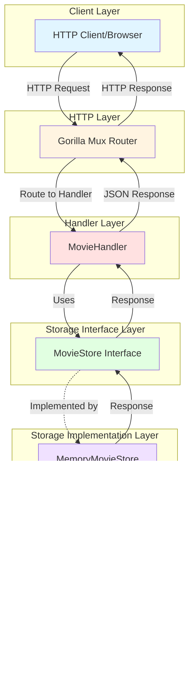

# Architecture Documentation

## Overview

The Go Movies CRUD application follows a clean, layered architecture pattern that separates concerns and promotes maintainability. The application is built using Go and provides a RESTful API for managing movie data.

## System Architecture



## Component Descriptions

### 1. HTTP Layer (Gorilla Mux Router)
- **Purpose**: Routes incoming HTTP requests to appropriate handler functions
- **Technology**: Gorilla Mux - a powerful URL router and dispatcher
- **Responsibilities**:
  - URL pattern matching
  - HTTP method routing
  - Request routing to handlers

### 2. Handler Layer (MovieHandler)
- **Purpose**: Processes HTTP requests and coordinates business logic
- **File**: `internal/handlers/movie_handler.go`
- **Responsibilities**:
  - Request validation and parsing
  - Calling storage layer methods
  - Response formatting (JSON encoding)
  - Error handling and HTTP status codes
  - Logging

### 3. Storage Interface Layer (MovieStore)
- **Purpose**: Defines the contract for data storage operations
- **File**: `internal/storage/interface.go`
- **Responsibilities**:
  - Abstraction layer for data operations
  - Enables easy swapping of storage implementations
  - Defines CRUD operations

### 4. Storage Implementation Layer (MemoryMovieStore)
- **Purpose**: Implements the MovieStore interface using in-memory storage
- **File**: `internal/storage/memory/movie_store.go`
- **Responsibilities**:
  - In-memory data storage
  - Thread-safe operations (using mutex)
  - CRUD operation implementation
  - ID generation and management

### 5. Model Layer
- **Purpose**: Defines the data structures used throughout the application
- **File**: `internal/models/movie.go`
- **Entities**:
  - **Movie**: Represents a movie with ID, ISBN, title, and director
  - **Director**: Represents a director with ID, first name, and last name

## Request Flow

### Example: Creating a Movie

1. **Client** sends POST request to `/movies` with JSON body
2. **Gorilla Mux Router** receives the request and routes it to `MovieHandler.CreateMovie`
3. **MovieHandler** decodes the JSON request body into a Movie struct
4. **MovieHandler** calls `store.Create(movie)` on the MovieStore interface
5. **MemoryMovieStore** implements the Create method:
   - Uses read lock (RLock) - Note: Thread safety limitation; should use write lock, which could lead to race conditions during concurrent creates
   - Generates a unique ID for the movie
   - Creates a Director entity with a UUID
   - Appends the movie to the in-memory slice
   - Returns the created movie
6. **MovieHandler** encodes the movie as JSON and sends it back
7. **Router** returns the HTTP response to the client

## API Endpoints

The application provides the following RESTful endpoints:

| Method | Endpoint | Description | Request Body | Response |
|--------|----------|-------------|--------------|----------|
| GET | `/movie?id={id}` | Get a single movie by ID | None | Movie JSON object |
| GET | `/movies` | Get all movies | None | Array of Movie JSON objects |
| POST | `/movies` | Create a new movie | Movie JSON (without ID) | Created Movie JSON object |
| PUT | `/movie/update` | Update an existing movie | Movie JSON (with ID) | Updated Movie JSON object |
| DELETE | `/movie/delete?id={id}` | Delete a movie by ID | None | Status code only |

### Request/Response Examples

#### Create Movie (POST /movies)
**Request:**
```json
{
  "isbn": "123456789",
  "title": "Inception",
  "director": {
    "firstname": "Christopher",
    "lastname": "Nolan"
  }
}
```

**Response:**
```json
{
  "id": "1",
  "isbn": "123456789",
  "title": "Inception",
  "director": {
    "id": "550e8400-e29b-41d4-a716-446655440000",
    "firstname": "Christopher",
    "lastname": "Nolan"
  }
}
```

## Design Patterns

### 1. Repository Pattern
The application uses the Repository pattern through the `MovieStore` interface, which:
- Abstracts data access logic
- Enables testing with mock implementations
- Allows easy migration to different storage backends (e.g., database)

### 2. Dependency Injection
- The `MovieHandler` receives its `MovieStore` dependency through its constructor
- This promotes loose coupling and testability

### 3. Layered Architecture
- Clear separation between HTTP handling, business logic, and data storage
- Each layer has well-defined responsibilities
- Changes in one layer don't affect others

## Thread Safety

The `MemoryMovieStore` uses `sync.RWMutex` to ensure thread-safe operations:
- **Read operations** (GetAll, GetByID): Use `RLock()` for concurrent reads
- **Write operations** (Update, Delete): Use `Lock()` for exclusive access
- **Create operation**: Currently uses `RLock()` - this is a known limitation as it modifies the slice and counter, which should ideally use `Lock()` for proper thread safety

## Future Enhancements

Potential improvements to the architecture:
1. **Database Integration**: Replace MemoryMovieStore with a database implementation
2. **Service Layer**: Add a business logic layer between handlers and storage
3. **Validation**: Implement request validation middleware
4. **Authentication/Authorization**: Add security layers
5. **Caching**: Implement caching for frequently accessed movies
6. **Logging**: Enhanced structured logging
7. **Metrics**: Add monitoring and metrics collection
