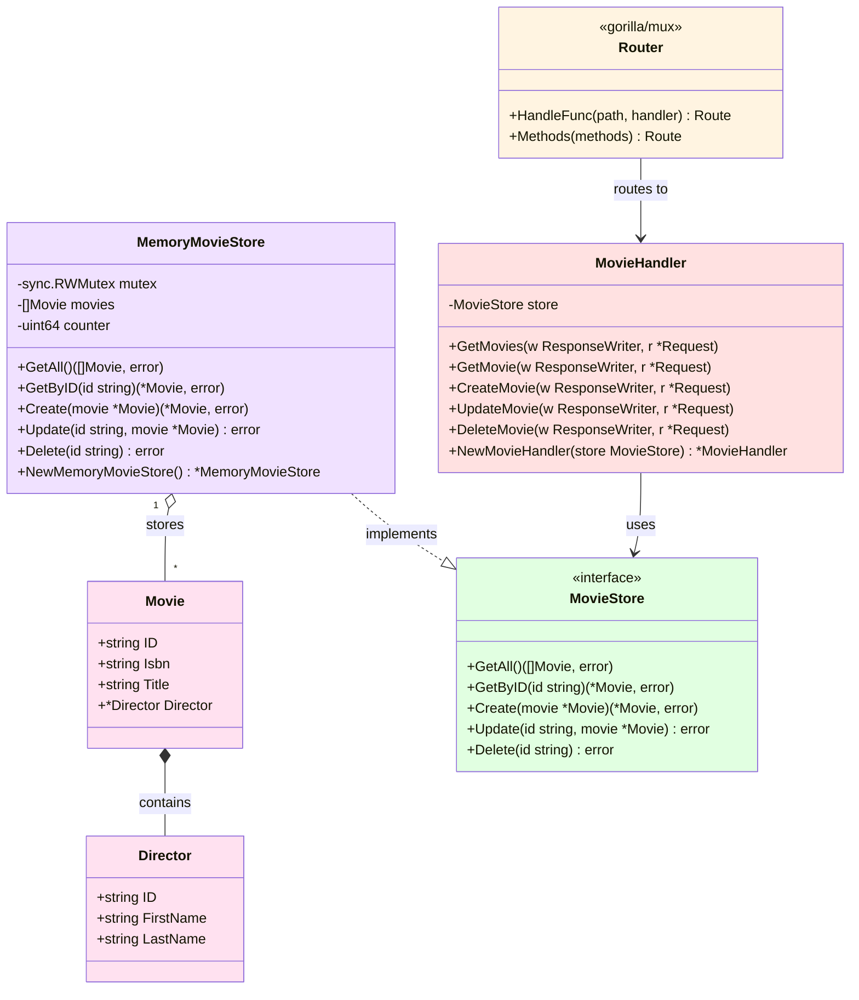
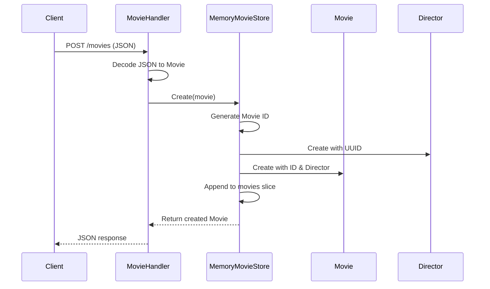

# Class Diagram Documentation

## Overview

This document provides UML class diagrams and descriptions for the Go Movies CRUD application, illustrating the relationships between different components and their structure.

## UML Class Diagram



## Detailed Class Descriptions

### Model Layer

#### Movie
**File**: `internal/models/movie.go`

**Purpose**: Represents a movie entity in the system.

**Fields**:
- `ID` (string): Unique identifier for the movie, auto-generated on creation
- `Isbn` (string): ISBN-like catalog number - Note: While named "ISBN" (typically for books), this field serves as a secondary catalog identifier for the movie
- `Title` (string): The title of the movie
- `Director` (*Director): Pointer to the Director entity associated with this movie

**Relationships**:
- **Composition** with Director: A Movie contains a Director (has-a relationship)

**JSON Mapping**:
```json
{
  "id": "1",
  "isbn": "123456789",
  "title": "Inception",
  "director": { ... }
}
```

---

#### Director
**File**: `internal/models/movie.go`

**Purpose**: Represents a director entity associated with movies.

**Fields**:
- `ID` (string): Unique identifier (UUID) for the director
- `FirstName` (string): Director's first name
- `LastName` (string): Director's last name

**JSON Mapping**:
```json
{
  "id": "550e8400-e29b-41d4-a716-446655440000",
  "firstname": "Christopher",
  "lastname": "Nolan"
}
```

---

### Storage Interface Layer

#### MovieStore (Interface)
**File**: `internal/storage/interface.go`

**Purpose**: Defines the contract for movie storage operations. This interface enables loose coupling and allows different storage implementations.

**Methods**:
- `GetAll() ([]models.Movie, error)`: Retrieves all movies from storage
- `GetByID(id string) (*models.Movie, error)`: Retrieves a specific movie by its ID
- `Create(movie *models.Movie) (*models.Movie, error)`: Creates a new movie and returns it with generated IDs
- `Update(id string, movie *models.Movie) error`: Updates an existing movie
- `Delete(id string) error`: Deletes a movie by its ID

**Design Pattern**: Repository Pattern - abstracts data access logic

---

### Storage Implementation Layer

#### MemoryMovieStore
**File**: `internal/storage/memory/movie_store.go`

**Purpose**: Implements the MovieStore interface using in-memory storage. Provides thread-safe CRUD operations for movies.

**Fields**:
- `mutex` (sync.RWMutex): Read-write mutex for thread-safe access to the movies slice
- `movies` ([]models.Movie): Slice storing all movies in memory
- `counter` (uint64): Auto-incrementing counter for generating movie IDs

**Methods**:
- `NewMemoryMovieStore() *MemoryMovieStore`: Constructor that initializes a new store
- `GetAll()`: Returns all movies (uses read lock)
- `GetByID(id)`: Searches for and returns a movie by ID (uses read lock)
- `Create(movie)`: Adds a new movie, generating both Movie ID and Director ID (currently uses read lock - this is a thread safety limitation)
- `Update(id, movie)`: Updates movie fields (uses write lock)
- `Delete(id)`: Removes a movie from the slice (uses write lock)

**Thread Safety**:
- Read operations (`GetAll`, `GetByID`) use `RLock()` for concurrent access
- Write operations (`Update`, `Delete`) use `Lock()` for exclusive access
- Create uses `RLock()` - Note: This is a limitation in the current implementation as it modifies both the counter and appends to the slice, which are write operations that should ideally use `Lock()` for proper thread safety

**Relationships**:
- **Implements** MovieStore interface
- **Contains** multiple Movie entities (one-to-many relationship)

---

### Handler Layer

#### MovieHandler
**File**: `internal/handlers/movie_handler.go`

**Purpose**: Handles HTTP requests for movie-related operations. Acts as the controller in the application, orchestrating between the HTTP layer and the storage layer.

**Fields**:
- `store` (storage.MovieStore): Reference to the storage interface for data operations

**Methods**:
- `NewMovieHandler(store MovieStore) *MovieHandler`: Constructor that injects the storage dependency
- `GetMovies(w, r)`: Handles GET /movies - returns all movies as JSON
- `GetMovie(w, r)`: Handles GET /movie?id={id} - returns a single movie
- `CreateMovie(w, r)`: Handles POST /movies - creates a new movie from JSON body
- `UpdateMovie(w, r)`: Handles PUT /movie/update - updates an existing movie
- `DeleteMovie(w, r)`: Handles DELETE /movie/delete?id={id} - deletes a movie

**Responsibilities**:
- HTTP request/response handling
- JSON encoding/decoding
- Error handling and HTTP status codes
- Calling storage layer methods
- Logging operations

**Relationships**:
- **Depends on** MovieStore interface (Dependency Injection)
- **Used by** Router for request handling

---

### HTTP Layer

#### Router (Gorilla Mux)
**Package**: `github.com/gorilla/mux`
**File**: `cmd/api/main.go`

**Purpose**: Routes incoming HTTP requests to appropriate handler methods based on URL patterns and HTTP methods.

**Key Methods Used**:
- `HandleFunc(path, handler)`: Registers a handler function for a path
- `Methods(methods)`: Specifies which HTTP methods are allowed

**Route Configuration**:
```go
r.HandleFunc("/movie", movieHandler.GetMovie).Methods("GET")
r.HandleFunc("/movies", movieHandler.GetMovies).Methods("GET")
r.HandleFunc("/movies", movieHandler.CreateMovie).Methods("POST")
r.HandleFunc("/movie/update", movieHandler.UpdateMovie).Methods("PUT")
r.HandleFunc("/movie/delete", movieHandler.DeleteMovie).Methods("DELETE")
```

---

## Relationships Summary

### Composition
- **Movie ← Director**: A Movie contains a Director instance (strong "has-a" relationship)

### Implementation
- **MemoryMovieStore → MovieStore**: MemoryMovieStore implements the MovieStore interface

### Association
- **MovieHandler → MovieStore**: MovieHandler uses MovieStore interface for data operations
- **Router → MovieHandler**: Router delegates requests to MovieHandler methods

### Aggregation
- **MemoryMovieStore ◊ Movie**: MemoryMovieStore aggregates multiple Movie instances

---

## Design Principles Demonstrated

### 1. Interface Segregation
- `MovieStore` interface provides only the necessary methods for movie storage
- Clean, focused contract without unnecessary methods

### 2. Dependency Inversion
- `MovieHandler` depends on the `MovieStore` interface, not on concrete implementations
- Makes the system flexible and testable

### 3. Single Responsibility
- Each class/struct has one clear purpose:
  - `Movie/Director`: Data representation
  - `MovieStore`: Storage contract definition
  - `MemoryMovieStore`: Storage implementation
  - `MovieHandler`: HTTP request handling

### 4. Open/Closed Principle
- New storage implementations can be added without modifying existing code
- Just implement the `MovieStore` interface (e.g., DatabaseMovieStore)

---

## Object Lifecycle

### Movie Creation Flow


---

## Thread Safety Considerations

The `MemoryMovieStore` uses different locking strategies:

1. **Read Lock (RLock)**: Used by:
   - `GetAll()` - Multiple goroutines can read simultaneously
   - `GetByID()` - Safe concurrent lookups
   - `Create()` - **Current implementation limitation**: Uses RLock even though it modifies the counter and appends to the slice

2. **Write Lock (Lock)**: Used by:
   - `Update()` - Ensures exclusive access during modification
   - `Delete()` - Prevents concurrent modifications during deletion

**Important Note**: The current implementation has a thread safety issue in `Create()` method:
- It uses `RLock()` but modifies both `counter` (increment) and `movies` slice (append)
- These are write operations that should use `Lock()` for proper thread safety
- This could lead to race conditions under concurrent Create operations

**Best Practice**: For production systems, consider:
- Using proper write locks (`Lock()`) for `Create()` since it modifies the counter and slice
- Implementing more granular locking mechanisms
- Considering concurrent-safe data structures

---

## Extensibility

The architecture supports easy extension:

### Adding a Database Implementation
```go
type DatabaseMovieStore struct {
    db *sql.DB
}

func (s *DatabaseMovieStore) GetAll() ([]models.Movie, error) {
    // Database implementation
}
// Implement other MovieStore methods...
```

### Adding New Handlers
```go
func (h *MovieHandler) SearchMovies(w http.ResponseWriter, r *http.Request) {
    // New functionality
}
```

### Adding Validation
```go
type ValidatingMovieStore struct {
    store MovieStore
}

func (v *ValidatingMovieStore) Create(movie *models.Movie) (*models.Movie, error) {
    // Validate movie
    return v.store.Create(movie)
}
```
